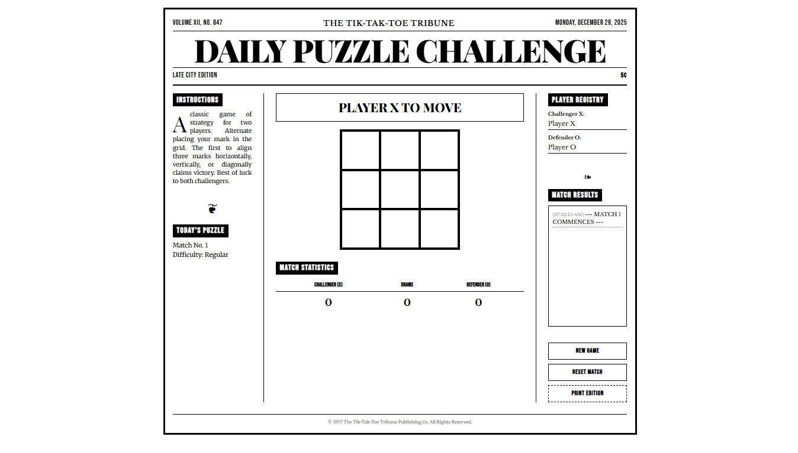
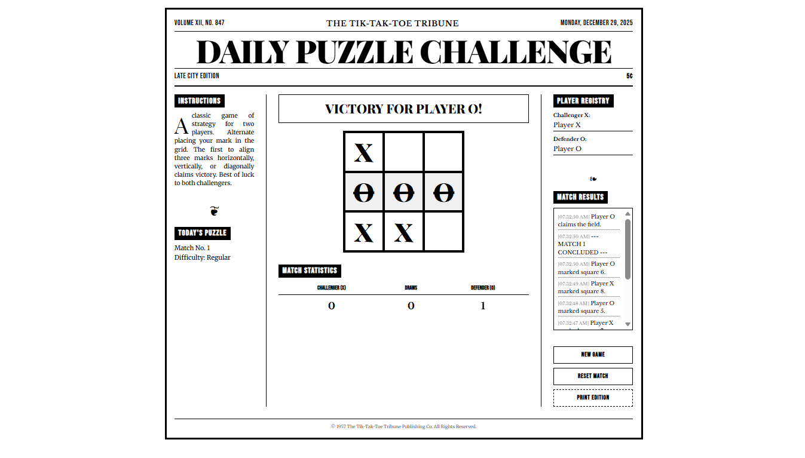

# 🗞️ The Tik-Tak-Toe Tribune

A vintage newspaper-styled Tik-Tak-Toe web application crafted with strong editorial design principles. This project evokes the charm of 1950s-1970s print media, featuring halftone textures, classic typography, and a functional broadsheet-style interface.

<div align="center">
  
  
</div>

## ✨ Features

- **Vintage Editorial Design**: Pure monochrome (#000000 and #FFFFFF) palette with halftone dot textures and paper overlays.
- **Dynamic Newspaper Layout**: 3-column broadsheet structure on desktop, transitioning to a vertical stack on mobile.
- **The Automaton (PvE)**: A built-in artificial opponent with three tiers of difficulty: _Elementary_, _Intermediate_, and _Grandmaster_.
- **Customizable Grid Size**: Choose from 3×3, 4×4, 5×5, or 6×6 boards with automatic win-condition tracking.
- **Interactive Game Board**: A "crossword-style" grid with serialized "ink-stamp" mark animations (X and O).
- **Match Tracking**: Real-time scoreboard for "Challenger" vs "Defender" and match counting.
- **Player Registry**: Editable player names that sync across the headline status and match logs.
- **Match Results Log**: Timestamped record of game events styled as a "Letters to the Editor" or results section.
- **Print Optimization**: Dedicated "Print Edition" button and CSS styles for a clean physical newspaper output.

## 🛠️ Technical Stack

- **HTML5**: Semantic layout using `<header>`, `<main>`, `<article>`, and `<aside>`.
- **Vanilla CSS3**:
  - **Typography**: Google Fonts (Playfair Display, Merriweather, Bebas Neue).
  - **Aesthetics**: Radial gradients for halftone effects, CSS animations for "stamping" marks.
  - **Grid/Flexbox**: Modern layout techniques for responsive editorial columns.
- **Vanilla JavaScript**:
  - **AI Engine**: Minimax algorithm with Alpha-Beta pruning for the "Grandmaster" automaton.
  - **State Management**: Dynamic win-condition generation for scales up to 6×6.
  - **Game Engine**: State-based logic handling win/draw conditions and UI synchronization.

## 🚀 Getting Started

1. **Clone the repository**:
   ```bash
   git clone https://github.com/JustinReyes28/TikTakToe.git
   ```
2. **Open the game**:
   Simply open `index.html` in any modern web browser.

## 🎨 Design Philosophy

The goal was to create a digital game that feels like a physical puzzle pulled from a Sunday newspaper. Every element—from the heavy 4px grid lines to the slight rotation of the "hand-stamped" marks—is designed to maintain the illusion of ink on paper.

## 📄 License

This project is licensed under the MIT License - see the [LICENSE](LICENSE) file for details.

---

_© 1957 The Tik-Tak-Toe Tribune Publishing Co. All Rights Reserved._
